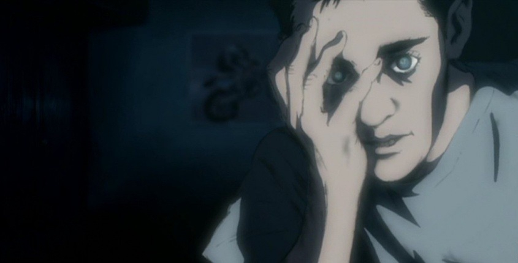

# A Kid's Story

*Somebody tell me.*      
*Why it feels more real when I dream than when I am awake.*      
*How can I know if my senses are lying?*      

*There is some fiction in your truth,*     
*and some truth in your fiction.*     
*To the truth, you must risk everything.*    

*Who are you?*      
*Am I alone?*      

*You are not alone.*    

